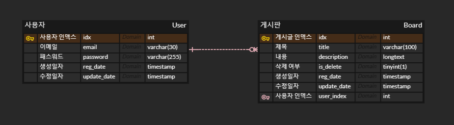

# 8월 원티드 프리온보딩 백엔드 인턴십 - 선발 과제

<br></br>

## 1. 지원자의 성명 : 유승완

<br>

## 2. 애플리케이션의 실행 방법

1. 개인 PC 또는 서버에 해당 프로젝트 clone 또는 복사하기

```
git clone https://github.com/seungwanRyu01/wanted-pre-onboarding-backend.git
```

2. 디렉토리 최상단 위치에 `.env` 파일 생성하기

```
touch .env
```

- `.env` 파일을 구성하고 있는 환경 변수

```
JWT_SECRET='[소/대문자 & 특수문자 & 숫자들을 임의로 섞은 긴 문자열]'
MYSQL_HOST='[AWS RDS 인스턴스 엔드포인트명]'
MYSQL_USER='[AWS RDS 인스턴스 마스터 사용자 이름]'
MYSQL_PORT='[AWS RDS 인스턴스 PORT 번호]'
MYSQL_PASSWORD='[AWS RDS 인스턴스 마스터 암호]'
MYSQL_DATABASE='[RDS 인스턴스에서 생성한 스키마 이름]'
NODE_ENV='development'
```

3. yarn 버전 확인하고 yarn이 없으면 yarn 설치

```
npm install
npm install yarn
```

4. yarn-berry로 변경해준 뒤 yarn install

```
yarn set version berry
yarn install
```

5. 아래 명령어를 통해 프로젝트 실행 후 로컬 환경에서 API 구동

```
yarn start:dev
```

### 📢 엔드포인트 호출 방법

- AWS EC2 인스턴스 엔드포인트 : **`http://3.35.201.56:3000`**

| **API Method** | **Endpoint Name**    | **Comment**      |
| -------------- | -------------------- | ---------------- |
| `POST`         | /users               | 사용자 회원가입  |
| `POST`         | /login               | 사용자 로그인    |
| `POST`         | /contents            | 게시글 생성      |
| `PATCH`        | /contents/{boardIdx} | 게시글 수정      |
| `DELETE`       | /contents/{boardIdx} | 게시글 삭제      |
| `GET`          | /whole-contents      | 게시글 목록 조회 |
| `GET`          | /element-contents    | 특정 게시글 조회 |

<br>

### 🏠 Architecture


<br>

## 3. 데이터베이스 ERD 설계도



<br>

## 4. 구현된 API 동작 데모 영상 링크

> https://youtu.be/x_ctSFFfraE

<br>

## 5. 프로젝트 구현 방법 및 이유에 대한 간략한 설명

1. **AWS Architecture를 구성하여 배포 환경 구성**

   - 사용자가 직접 로컬 환경을 구축해야 하는 번거로움을 덜기 위한 목적
   - 접속 트래픽 관리에 용이함
   - ELB를 이용하면 트래픽에 따른 서버 확장과 축소가 가능
   - PM2로 무중단 배포 기능 도입

2. **NPM 대신 Yarn Berry로 node package 관리**

   - 의존성 관리는 npm보다 훨씬 용이하고 패키지 탐색 속도 최적화
   - 유령 의존성 문제 해결
   - `node_modules` 대신 `.pnp.cjs` 파일로 패키지 관리
   - 패키지 설치 속도 및 의존성 차지 공간 크기 절약

<br>

## 6. API 구현 방법 및 이유

1. **POST : `/users` [사용자 회원가입]**

   - 회원가입 시도하는 유저의 이메일이 유저 테이블에 존재할 때, 이메일 중복 에러 처리
   - SHA 알고리즘이라는 단방향 암호화 방식이 적용된 패스워드를 유저 테이블에 저장

2. **POST : `/login` [사용자 로그인]**

   - 사용자가 입력한 비밀번호와 유저 테이블의 암호화된 비밀번호를 대조하여 로그인 성공/실패 여부 리턴
   - 로그인 성공시, 환경변수의 JWT_SECRET Key를 가져와서 유효기간 1년짜리 JWT 토큰을 userIdx와 함께 리턴

3. **POST : `/contents` [게시글 생성]**

   - Header에 `x-access-token`을 설정하고 해당 value에 로그인할 때 리턴된 JWT 토큰 기입
   - 게시글 작성 성공시, 코드와 메시지와 함께 저장된 작성글의 index도 함께 리턴
     - 프론트엔드 개발자가 해당 인덱스를 이용하여 조회, 수정, 삭제 작업할 때 사용

4. **PATCH : `/contents/{boardIdx}` [게시글 수정]**

   - Query String 방식 대신 Path Variable 방식을 사용하여 엔드포인트의 활용폭을 넓힘
   - boardIdx의 작성자가 jwt 토큰의 userIdx와 다르면 작성자가 다르다는 내용의 에러 내용 리턴
   - title이나 content 둘 중 하나만 수정해도 수정 전 테이블에 저장된 데이터 원본 보존
   - 네트워크 에러 및 데이터 베이스 에러를 대비한 트랜잭션 적용

5. **DELETE : `/contents/{boardIdx}` [게시글 삭제]**

   - Query String 방식 대신 Path Variable 방식을 사용하여 엔드포인트의 활용폭을 넓힘
   - boardIdx의 작성자가 jwt 토큰의 userIdx와 다르면 작성자가 다르다는 내용의 에러 내용 리턴
   - 네트워크 에러 및 데이터 베이스 에러를 대비한 트랜잭션 적용
   - Request Body에 들어갈 내용 필요 없음
   - 삭제가 완료되면 테이블에 있는 데이터 삭제 대신 `is_delete`의 필드값을 1로 변경하여 삭제 처리
     - 삭제 데이터 보존하여 추후 복구 가능성 여지 남겨두기

6. **GET : `/whole-contents` [게시글 목록 조회]**

   - Query String 방식의 Parameter에 page, pageSize 기입
   - page : 현재 페이지 위치 지정
   - pageSize : 한 페이지당 출력되는 데이터 갯수 지정
   - `is_delete = 1`인 데이터는 출력되지 않음

7. **GET : `/element-contents` [특정 게시글 조회]**

   - Query String 방식의 Parameter에 board_index 기입
   - board_index : 조회할 게시글 인덱스
   - `is_delete = 1`인 데이터는 출력되지 않음

<br>

## 7. API 명세서

> https://documenter.getpostman.com/view/18428720/2s9Xy6qq67
